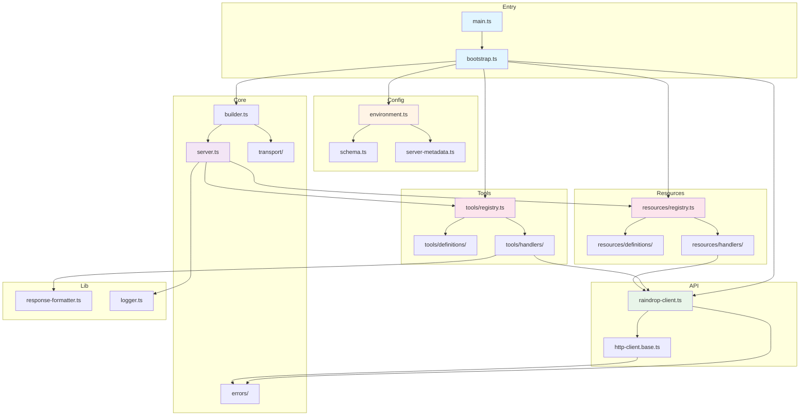
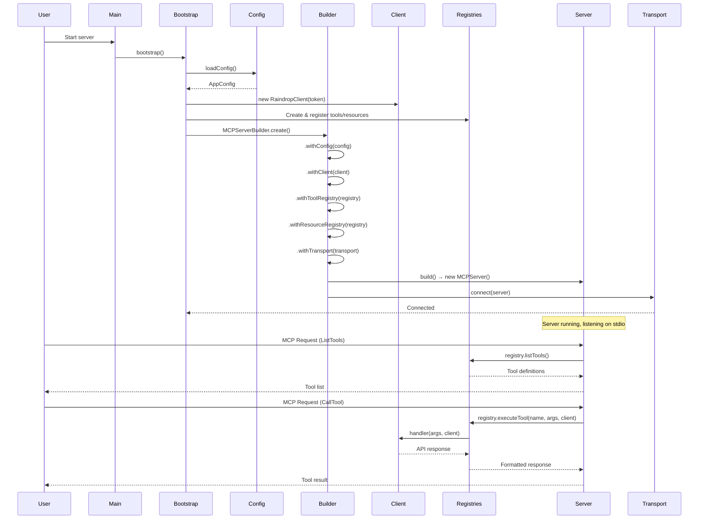
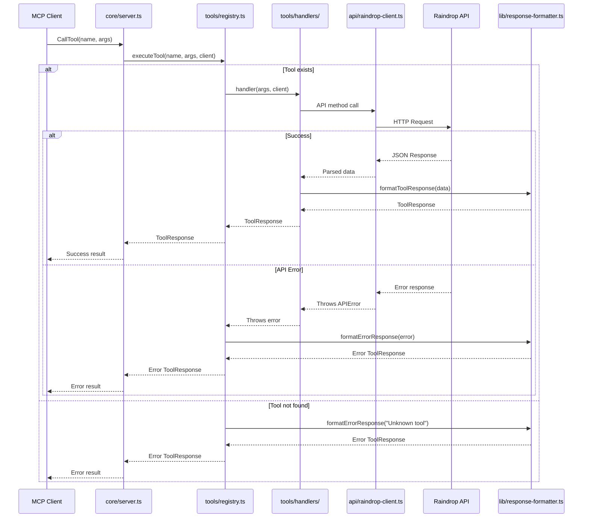
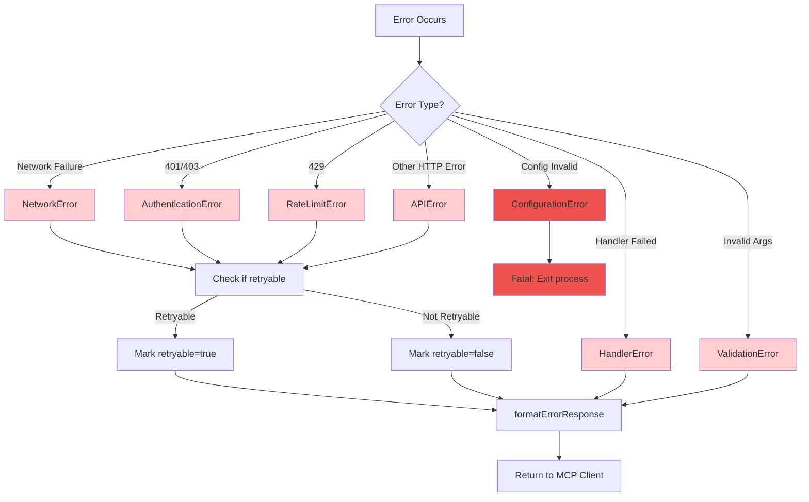
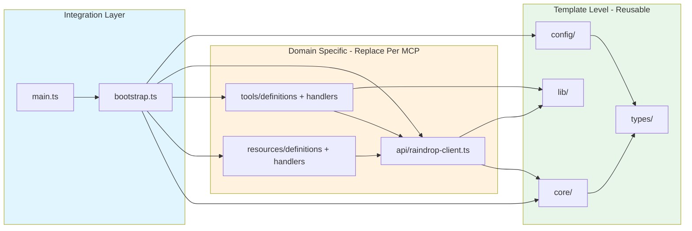
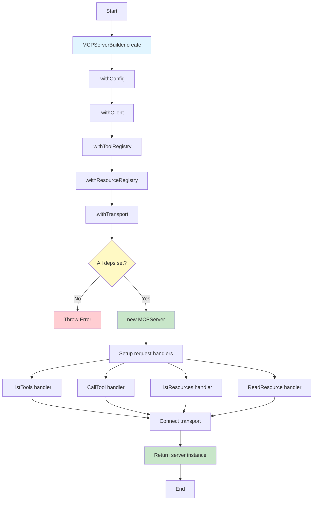

# Architecture Diagrams

## Component Architecture

```mermaid
graph TB
    subgraph Entry
        M[main.ts]
        B[bootstrap.ts]
    end

    subgraph Config
        ENV[environment.ts]
        SCHEMA[schema.ts]
        META[server-metadata.ts]
    end

    subgraph Core
        SERVER[server.ts]
        BUILDER[builder.ts]
        TRANSPORT[transport/]
        ERRORS[errors/]
    end

    subgraph API
        BASE[http-client.base.ts]
        CLIENT[raindrop-client.ts]
    end

    subgraph Tools
        TREG[tools/registry.ts]
        TDEF[tools/definitions/]
        THAND[tools/handlers/]
    end

    subgraph Resources
        RREG[resources/registry.ts]
        RDEF[resources/definitions/]
        RHAND[resources/handlers/]
    end

    subgraph Lib
        FORMAT[response-formatter.ts]
        LOG[logger.ts]
    end

    M --> B
    B --> ENV
    B --> CLIENT
    B --> TREG
    B --> RREG
    B --> BUILDER
    
    ENV --> SCHEMA
    ENV --> META
    
    BUILDER --> SERVER
    BUILDER --> TRANSPORT
    
    CLIENT --> BASE
    CLIENT --> ERRORS
    
    TREG --> TDEF
    TREG --> THAND
    THAND --> FORMAT
    THAND --> CLIENT
    
    RREG --> RDEF
    RREG --> RHAND
    RHAND --> CLIENT
    
    SERVER --> TREG
    SERVER --> RREG
    SERVER --> LOG
    
    BASE --> ERRORS

    style M fill:#e1f5ff
    style B fill:#e1f5ff
    style ENV fill:#fff4e6
    style CLIENT fill:#e8f5e9
    style SERVER fill:#f3e5f5
    style TREG fill:#fce4ec
    style RREG fill:#fce4ec
```

## Data Flow Diagram

```mermaid
sequenceDiagram
    participant User
    participant Main
    participant Bootstrap
    participant Config
    participant Builder
    participant Client
    participant Registries
    participant Server
    participant Transport

    User->>Main: Start server
    Main->>Bootstrap: bootstrap()
    Bootstrap->>Config: loadConfig()
    Config-->>Bootstrap: AppConfig
    
    Bootstrap->>Client: new RaindropClient(token)
    Bootstrap->>Registries: Create & register tools/resources
    
    Bootstrap->>Builder: MCPServerBuilder.create()
    Builder->>Builder: .withConfig(config)
    Builder->>Builder: .withClient(client)
    Builder->>Builder: .withToolRegistry(registry)
    Builder->>Builder: .withResourceRegistry(registry)
    Builder->>Builder: .withTransport(transport)
    
    Builder->>Server: build() → new MCPServer()
    Builder->>Transport: connect(server)
    Transport-->>Bootstrap: Connected
    
    Note over Server: Server running, listening on stdio
    
    User->>Server: MCP Request (ListTools)
    Server->>Registries: registry.listTools()
    Registries-->>Server: Tool definitions
    Server-->>User: Tool list
    
    User->>Server: MCP Request (CallTool)
    Server->>Registries: registry.executeTool(name, args, client)
    Registries->>Client: handler(args, client)
    Client-->>Registries: API response
    Registries-->>Server: Formatted response
    Server-->>User: Tool result
```

## Tool Execution Flow

```mermaid
sequenceDiagram
    participant MCP as MCP Client
    participant Server as core/server.ts
    participant Registry as tools/registry.ts
    participant Handler as tools/handlers/
    participant Client as api/raindrop-client.ts
    participant API as Raindrop API
    participant Formatter as lib/response-formatter.ts

    MCP->>Server: CallTool(name, args)
    Server->>Registry: executeTool(name, args, client)
    
    alt Tool exists
        Registry->>Handler: handler(args, client)
        Handler->>Client: API method call
        Client->>API: HTTP Request
        
        alt Success
            API-->>Client: JSON Response
            Client-->>Handler: Parsed data
            Handler->>Formatter: formatToolResponse(data)
            Formatter-->>Handler: ToolResponse
            Handler-->>Registry: ToolResponse
            Registry-->>Server: ToolResponse
            Server-->>MCP: Success result
        else API Error
            API-->>Client: Error response
            Client-->>Handler: Throws APIError
            Handler-->>Registry: Throws error
            Registry->>Formatter: formatErrorResponse(error)
            Formatter-->>Registry: Error ToolResponse
            Registry-->>Server: Error ToolResponse
            Server-->>MCP: Error result
        end
    else Tool not found
        Registry->>Formatter: formatErrorResponse("Unknown tool")
        Formatter-->>Registry: Error ToolResponse
        Registry-->>Server: Error ToolResponse
        Server-->>MCP: Error result
    end
```

## Error Flow

```mermaid
graph TD
    A[Error Occurs] --> B{Error Type?}
    
    B -->|Network Failure| C[NetworkError]
    B -->|401/403| D[AuthenticationError]
    B -->|429| E[RateLimitError]
    B -->|Other HTTP Error| F[APIError]
    B -->|Handler Failed| G[HandlerError]
    B -->|Invalid Args| H[ValidationError]
    B -->|Config Invalid| I[ConfigurationError]
    
    C --> J[Check if retryable]
    D --> J
    E --> J
    F --> J
    
    J -->|Retryable| K[Mark retryable=true]
    J -->|Not Retryable| L[Mark retryable=false]
    
    K --> M[formatErrorResponse]
    L --> M
    G --> M
    H --> M
    I --> N[Fatal: Exit process]
    
    M --> O[Return to MCP Client]
    
    style C fill:#ffcdd2
    style D fill:#ffcdd2
    style E fill:#ffcdd2
    style F fill:#ffcdd2
    style G fill:#ffcdd2
    style H fill:#ffcdd2
    style I fill:#ef5350
    style N fill:#ef5350
```

## Module Dependencies

```mermaid
graph LR
    subgraph Template_Level[Template Level - Reusable]
        TYPES[types/]
        CONFIG[config/]
        CORE[core/]
        LIB[lib/]
    end
    
    subgraph Domain_Specific[Domain Specific - Replace Per MCP]
        API[api/raindrop-client.ts]
        TOOLS[tools/definitions + handlers]
        RESOURCES[resources/definitions + handlers]
    end
    
    subgraph Integration[Integration Layer]
        BOOTSTRAP[bootstrap.ts]
        MAIN[main.ts]
    end
    
    MAIN --> BOOTSTRAP
    BOOTSTRAP --> CONFIG
    BOOTSTRAP --> API
    BOOTSTRAP --> TOOLS
    BOOTSTRAP --> RESOURCES
    BOOTSTRAP --> CORE
    
    API --> LIB
    API --> CORE
    TOOLS --> LIB
    TOOLS --> API
    RESOURCES --> API
    CORE --> TYPES
    CONFIG --> TYPES
    
    style Template_Level fill:#e8f5e9
    style Domain_Specific fill:#fff3e0
    style Integration fill:#e1f5ff
```

## Builder Pattern Flow

```mermaid
graph TD
    A[Start] --> B[MCPServerBuilder.create]
    B --> C[.withConfig]
    C --> D[.withClient]
    D --> E[.withToolRegistry]
    E --> F[.withResourceRegistry]
    F --> G[.withTransport]
    G --> H{All deps set?}
    
    H -->|No| I[Throw Error]
    H -->|Yes| J[new MCPServer]
    
    J --> K[Setup request handlers]
    K --> L[ListTools handler]
    K --> M[CallTool handler]
    K --> N[ListResources handler]
    K --> O[ReadResource handler]
    
    L --> P[Connect transport]
    M --> P
    N --> P
    O --> P
    
    P --> Q[Return server instance]
    Q --> R[End]
    
    style B fill:#e1f5ff
    style H fill:#fff9c4
    style I fill:#ffcdd2
    style J fill:#c8e6c9
    style Q fill:#c8e6c9
```
